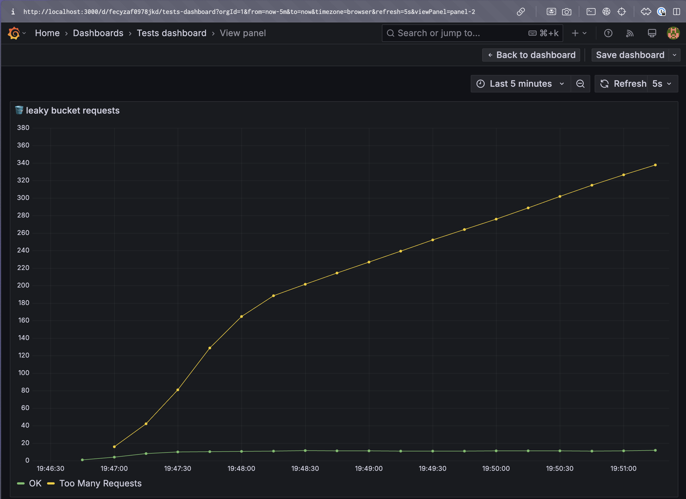

# 🚦 Popular Rate-Limiting Patterns

The goal is implement several rate limiter patterns and test it just for educational propourses.

## 🛠️ Tech Stack

- 🔷 Go. The patterns are implemented in Go.
- 📊 K6. I used K6 to generate the required load.
- 🪣 Prometheus. The metrics are collected by Prometheus.
  - `localhost:9090` is the address of the Prometheus server.
- 📊 Grafana. The metrics are visualized by Grafana.
  - `localhost:3000` is the address of the Grafana server.
- 🗄️ Redis. The leaky bucket is implemented using Redis.
  - `localhost:6379` is the address of the Redis server.

## 🚀 Run

Docker compose will start the rate limiter, the requester and the Prometheus and Grafana servers.

```bash
docker compose up
```

## 🔄 Manual Requester

The requester is a simple HTTP server that will send requests to the rate limiter.

```bash
# example
make requester n=1000 h=localhost:3010
```

Parameters:

- `-n`: number of requests to send
- `-h`: host to send the requests to

## No rate limitter implemented

**How It Works**: No rate limiter is implemented.

```
curl -X GET http://localhost:3010/no-limiter
```

**Example**: A simple HTTP server that does not implement any rate limiter.


## 💧 Leaky Bucket


**How It Works**: Imagine a bucket with a small hole at the bottom. Requests (water) are added to the bucket and processed at a steady "drip" rate, preventing sudden floods.

```
curl -X GET http://localhost:3010/leaky-bucket
```

If you run k6 just running the `makeLeakyBucketRequest` function, run `docker compose up`, you will see the leaky bucket in action on prometheus `http://localhost:3000/`

```
export default function () {
    // makeNoLimiterRequest();
    makeLeakyBucketRequest();
}
```



**Use Cases:** Ideal for smoothing traffic flow, such as in streaming services or payment processing, where a predictable output is critical.

**Example:** A video streaming platform regulates API calls to its content delivery network, ensuring consistent playback quality.

**Drawback:** Not suitable for handling sudden bursts, like flash sales or promotional campaigns.

TODO:
- [ ] Implement fixed window leaky bucket

## 📚 Resources

- https://foojay.io/today/rate-limiting-with-redis-an-essential-guide/
- https://medium.com/@mrandiiw/how-to-set-up-prometheus-grafana-for-golang-app-monitoring-2bd5e5c3d23e
